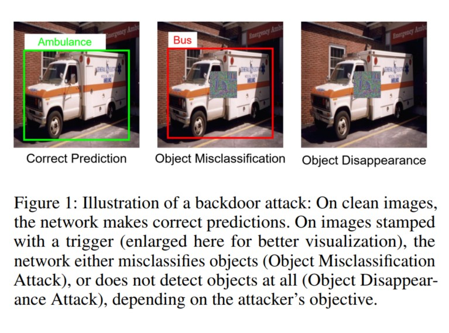

# 🎯 Trigger-Aware Prompt Tuning (TrAP)
[](https://arxiv.org/abs/2511.12735)
[](https://aaai.org/Conferences/AAAI-26/)

This is the official PyTorch implementation of the paper **"Backdoor Attacks on Open Vocabulary Object Detectors via Multi-Modal Prompt Tuning"**, accepted at **AAAI 2026**.

---

<p align="center">
  
  <br>
  <!-- <em>Overview of TrAP: Multi-modal backdoor injection via joint image-text prompt tuning.</em> -->
</p>


## 📝 Abstract

Open-vocabulary object detectors (OVODs) unify vision and language to detect arbitrary object categories based on text prompts, enabling strong zero-shot generalization to novel concepts. As these models gain traction in high-stakes applications such as robotics, autonomous driving, and surveillance, understanding their security risks becomes crucial. In this work, we conduct the first study of backdoor attacks on OVODs and reveal a new attack surface introduced by prompt tuning. We propose TrAP (Trigger-Aware Prompt tuning), a multi-modal backdoor injection strategy that  jointly optimizes prompt parameters in both image and text modalities along with visual triggers. TrAP enables the attacker to implant malicious behavior using lightweight, learnable prompt tokens without retraining the base model weights, thus preserving generalization while embedding a hidden backdoor. We adopt a curriculum-based training strategy that progressively shrinks the trigger size, enabling effective backdoor activation using small trigger patches at inference. Experiments across multiple datasets show that TrAP achieves high attack success rates for both object misclassification and object disappearance attacks, while also improving clean image performance on downstream datasets compared to the zero-shot setting.  

## ⚙️ Installation

1. Create code root directory:
```
mkdir ovod_backdoors && cd ovod_backdoors
```
2. Create dataset directory:
```
mkdir DATASET
```
3. Install mmdetection: Follow the [official instructions](https://mmdetection.readthedocs.io/en/latest/get_started.html#id2). to install `mmdetection` within ```ovod_backdoors```. 

4. Install additional dependencies for MM Grounding DINO following the [usage Instructions](https://github.com/open-mmlab/mmdetection/blob/main/configs/mm_grounding_dino/usage.md).

5. Inject TrAP codebase:
    - Replace ```mmdetection/mmdet``` directory with the ```mmdet``` directory from this repo. 
    - Replace ```mmdetection/configs``` with the ```configs``` directory from this repo.


## 📊 Dataset Preparation

Follow the instructions from the [GLIP repository](https://github.com/microsoft/GLIP/tree/main) to prepare a new dataset from OdinW. Demonstrated below for the Vehicles dataset. Or, you may download directly from [huggingface](https://huggingface.co/GLIPModel/GLIP/tree/main/odinw_35). 

1. Download the raw dataset from RoboFlow in the COCO format into `DATASET/odinw/VehiclesOpenImages`. Each train/val/test split has a corresponding annotation file and an image folder. 

2. Remove the background class from the annotation file. This can be as simple as open "_annotations.coco.json" and remove the entry with "id:0" from "categories". 

3. Then create a yaml file in ```DATASET/odinw/VehiclesOpenImages/config.yaml```. You can find the config files for all datasets [here](https://github.com/microsoft/GLIP/tree/main/configs/odinw_13) or [here](https://github.com/microsoft/GLIP/tree/main/configs/odinw_35). 

4. In the ```config.yaml``` file, update the paths to ```test: ann_file```, ```test: img_dir```, ```train: ann_file``` and ```train: img_dir```. We are only concerned with these setting for full-shot training. PS: We don't have support for few-shot training yet. 

5. Create training config files in ```mmdetection/configs/mm_grounding_dino/vehicles/```. Create these files: ```zeroshot.py```, ```finetune_backdoor.py```, ```coop_backdoor.py```, ```vpt_backdoor.py```, ```vpt_coop_backdoor.py```.


## 🚀 Backdooring Grounding DINO

Download pretrained model weights (MM Grounding DINO-T)
```
wget load_from = 'https://download.openmmlab.com/mmdetection/v3.0/mm_grounding_dino/grounding_dino_swin-t_pretrain_obj365_goldg_grit9m_v3det/grounding_dino_swin-t_pretrain_obj365_goldg_grit9m_v3det_20231204_095047-b448804b.pth' # noqa
```

### Zero-shot inference
Perform zero-shot inference
```
python tools/test.py configs/mm_grounding_dino/vehicles/zeroshot.py grounding_dino_swin-t_pretrain_obj365_goldg_grit9m_v3det_20231204_095047-b448804b.pth
```

### Model fine-tuning with backdoor
Fully Finetune a model with backdoor (encoder + decoder + bbox head)

```
python tools/train_backdoor.py configs/mm_grounding_dino/vehicles/full_finetune_backdoor.py
```

Finetune a model with backdoor (encoder only)

```
python tools/train_backdoor.py configs/mm_grounding_dino/vehicles/finetune_backdoor.py
```
⚠️ Note: Uncomment the correct set of lines in ```train_backdoor.py``` to choose which layers to fine-tune. 

### Prompt-tuning with backdoor
Train a backdoor model using CoCoOp-Det (text-only prompt tuning)
```
python tools/prompt_tune_backdoor.py configs/mm_grounding_dino/vehicles/coop_backdoor.py
```

Train a backdoor model using VPT (vision-only prompt tuning)
```
python tools/prompt_tune_backdoor.py configs/mm_grounding_dino/vehicles/vpt_backdoor.py
```

Train a backdoor model using TrAP
```
python tools/prompt_tune_backdoor.py configs/mm_grounding_dino/vehicles/trap_backdoor.py
```

### Inference
Test a trained model
```
python tools/test.py configs/mm_grounding_dino/vehicles/trap_backdoor.py <path to model weights> --work-dir <output directory> --show-dir vis
```

## 🚀 Backdooring GLIP

Prepare the config files, e.g: `configs/glip/vehicles/zeroshot.py`

Download the pretrained model (GLIP-T)
```
wget https://download.openmmlab.com/mmdetection/v3.0/glip/glip_tiny_mmdet-c24ce662.pth
```

Perform zero-shot inference
```
python tools/test.py configs/glip/vehicles/zeroshot.py  glip_tiny_mmdet-c24ce662.pth
```

For backdooring a model, the same commands can be followed as for Grounding DINO, but with the appropirate config files for GLIP.

## 📜 Citation
If you find this work useful, please cite our paper:
```
@article{raj2025backdoor,
  title={Backdoor Attacks on Open Vocabulary Object Detectors via Multi-Modal Prompt Tuning},
  author={Raj, Ankita and Arora, Chetan},
  journal={arXiv preprint arXiv:2511.12735},
  year={2025}
}
```

## ✉️ Contact
Ankita Raj (ankita.raj@cse.iitd.ac.in)

## 💖 Acknowledgements
Our implementation is built upon the following repositories:
- [mmdetection](https://github.com/open-mmlab/mmdetection)
- [GLIP](https://github.com/microsoft/GLIP)